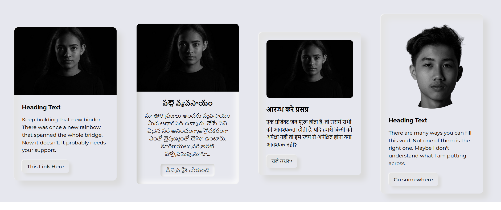
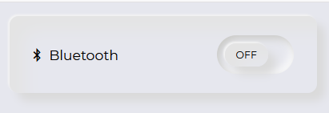
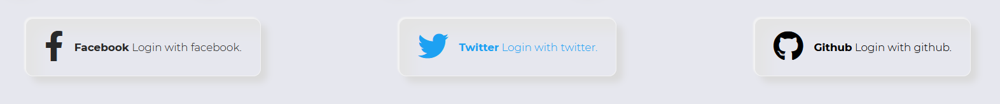
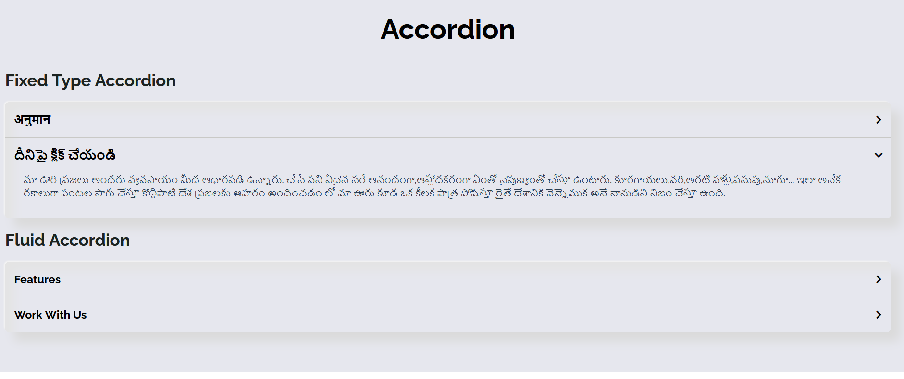

#  triKone

## 

🦚 - A style library for the fashionable front-enders

**triKone** is a Sass library that collects all the different UI components or kits surrounding a particular UI/UX trend. It is easy to implement. Use this library when you want to incorporate the design principles surrounding a design methodolody in your products.

triKone currently covers the **Neumorphic** design trend.

Design Trends in pipeline:

(a) CSS 3D

(b) CSS microanimations

We look at integrating style as step zero in a product's growth trajectory. The newest design trends can be looked up here, and utilized without going deep into understanding them (_not that there is anything wrong with that_).

> Something that hasn't been 'adjusted to' has been 'adjusted with'. -- **Multiple sources**

Simply download our styling from the CDN and then cherry-pick the component from the library to add it to your app:

We've tried to add all kinds of components here:

With multiple variants of every type:

And some esoteric ones too:

We hope more and more people use these styles and make products that are instantly appealing to the eye.

## Built With ⛏️

[s]: #built-with-⛏️ "S/w stack"

- **Sass**: The choice of the champions.

## Getting Started 🚀

You can cherry-pick the component you desire from the [website](https://bharat-patodi.github.io/trikone/).

## Contributing 🎅

[c]: #Contributing-🎅 "Guidelines for contribution"

Please read [CONTRIBUTING.md](link-to-contributing.md) for details on our code of conduct, and the process for submitting pull requests to us.

See also the list of [contributors](https://github.com/bharat-patodi/trikone/graphs/contributors) who participated in this project.

## Versioning

[v]: #versioning "Maintaining the different versions"

We use [SemVer](http://semver.org/) for versioning. For the versions available, see the [tags on this repository](https://github.com/bharat-patodi/trikone/tags).

## Authors 🦹

[a]: #Authors-🦹 "All the authors"

- **Tinkal Deka** - _Grunt Worker_ [Twitter Profile](https://twitter.com/tinkal_deka)
- **Abhijeet Burman** - _Grunt Worker_ [Twitter Profile](https://twitter.com/abhi_burman)
- **Kushal Dave** - _Grunt Worker_ [Twitter Profile](https://twitter.com/ikushaldave)
- **Bharat Patodi** - _Grunt Worker_ [Twitter Profile](https://twitter.com/bharatpatodi)

## License

[l]: #license "License type"

This project is licensed under the MIT License - see the [LICENSE.md](LICENSE.md) file for details

## Acknowledgements ❤️

[ack]: #acknowledgements-❤️ "Inspirations, and code gifts"

- Icon credits: [Freepik](http://www.freepik.com/) from [Flaticon](https://www.flaticon.com/)
- Image credits: [unsplash](www.unsplash.com)
- CSS Reset by [Eric Meyer](https://meyerweb.com/eric/tools/css/reset/)
- Neumorphism Design Learning -

  [Michal Malewicz](http://michalmalewicz.com/)

  [Adam Giebl](https://neumorphism.io/#55b9f3)

  [CSS-tricks](https://css-tricks.com/neumorphism-and-css/)

  [themesberg](https://demo.themesberg.com/neumorphism-ui/html/components/all.html#top)

- Fonts from [Google Fonts](fonts.google.com)
